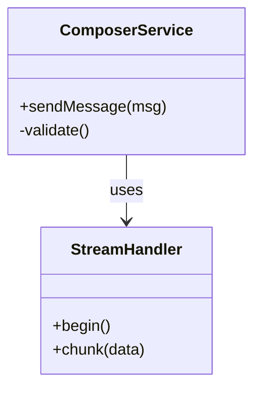
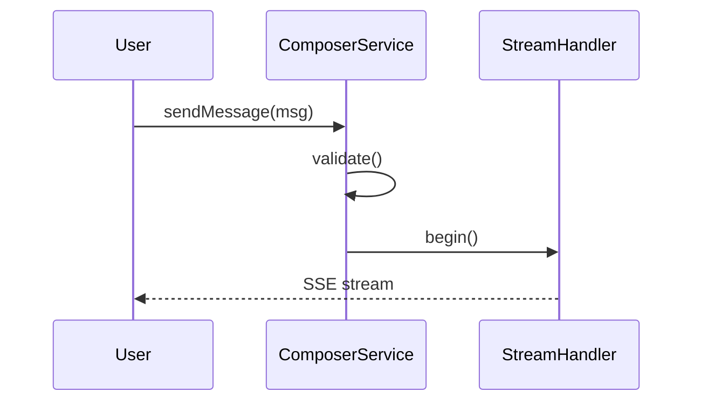
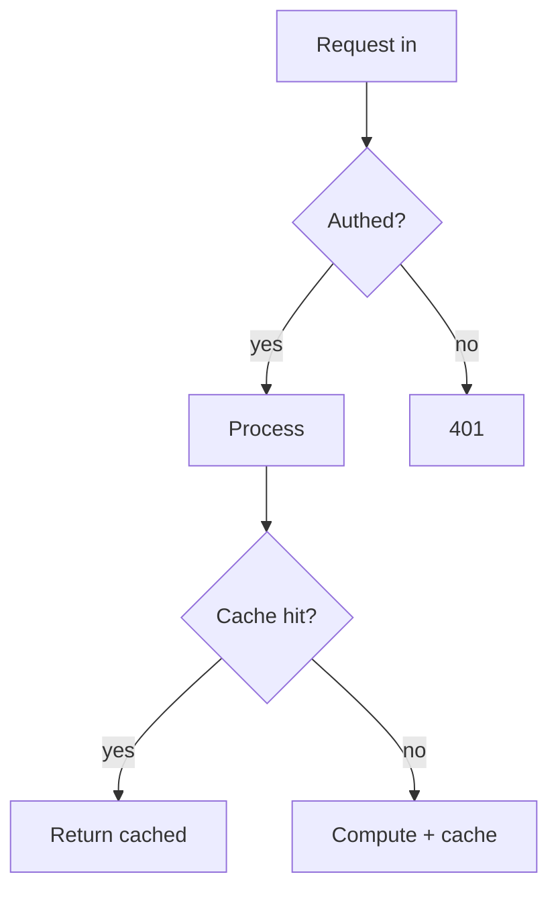

# Output Format Specification

本檔為輸出格式規範，由主 agent 讀取後轉發給 explainer／synthesizer sub-agent 作為撰寫依據。主 agent 不照此檔指示執行動作，僅作為轉發資料。

---

## 固定五段結構

最終解釋**必須**含下列五段，標題逐字一致：

1. **概覽**
2. **核心概念**
3. **運作方式**
4. **檔案位置**
5. **Gotchas**

段落順序不可調整。若某段對該題目無內容，保留標題並寫「（本題無需此段）」+ 一句話說明；不可整段省略。

## 各段內容規範

### 概覽

1–2 段落。這是什麼、做什麼、為何存在。讀完此段應能判斷是否需繼續讀下去。**不含圖。**

### 核心概念

列出理解後續段落所需的核心 type、service、class、抽象。每項附一句話定義，不求詳盡。

**必放圖：** Mermaid `classDiagram` 或 `erDiagram`，呈現核心型別／模組之間的相依或繼承關係。

範例：



### 運作方式

核心段落。走過整個流程：什麼觸發、一步一步發生什麼、資料流向哪裡、決策點在哪。用散文，不用 pseudocode。引用檔案與函式名讓讀者可自行查證，但**不 dump 大段程式碼**，除非某片段是理解關鍵。

**必放圖，依流程型態挑選：**

| 流程型態 | 圖型 |
|---|---|
| 時序／簡單線性呼叫鏈 | ASCII 箭頭圖 |
| 多角色互動時序 | Mermaid `sequenceDiagram` |
| 含狀態／多分支決策 | Mermaid `flowchart` |
| 類別／模組關係（若核心概念已畫則不重複） | Mermaid `classDiagram` |

**ASCII 箭頭圖範例：**

```
User click
  → ComposerService.sendMessage()
  → validate()
  → StreamHandler.begin()
  → SSE to client
```

**Mermaid sequenceDiagram 範例：**



**Mermaid flowchart 範例：**



### 檔案位置

簡要檔案／目錄地圖。只列讀者需要找的關鍵檔案，不窮舉。

**必放圖：** ASCII tree。

範例：

```
src/
├── composer/
│   ├── composer-service.ts     # 入口，處理送出請求
│   ├── validator.ts            # 前置驗證
│   └── stream-handler.ts       # SSE 串流核心
├── types/
│   └── message.ts              # Message 型別定義
└── routes/
    └── api/compose.ts          # HTTP endpoint
```

### Gotchas

不明顯之處、令人意外的行為、歷史脈絡、銳角。若本題無 gotcha 可列，保留標題並寫「（無明顯 gotcha）」。

**不放圖。**

需特別標示的情況：

- Doc explorer findings 與 code 實作不一致時，以「文件與實作不一致：」起頭列出
- Explorer 明確回報無法追蹤之處，以「探索未覆蓋區域：」起頭列出

## 引用規範

- 檔案路徑使用正斜線：`src/foo/bar.ts`
- 行號引用格式：`src/foo/bar.ts:42`
- 函式／方法名精確引用，不改寫
- 不得引用不存在的檔案或函式

## Terminal Mermaid 提示行

若最終輸出含任何 Mermaid 區塊（```mermaid），在輸出的**最後一行**逐字附上：

> 此回覆含 Mermaid 圖，terminal 僅顯示原始碼；存檔後於 IDE／GitHub 預覽可看渲染版。

若輸出僅含 ASCII 圖、未含 Mermaid 區塊，不附此提示行。

## 長度與密度

- 總長度依題目複雜度調整，無硬性字數上限
- 單段超過 400 字時檢視是否能拆為子段
- 概覽段 ≤ 2 段落
- 圖表與 prose 比例：每段圖表應有對應 prose 說明，不讓圖獨立承擔解釋責任
