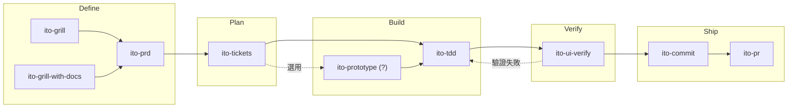

# ITO Agent Skills

一套為 Claude Code 設計的 agent skill 集合，涵蓋從需求釐清到 PR 建立的完整開發流程。

## 快速安裝

透過 [`npx skills`](https://github.com/vercel-labs/skills)（Open Agent Skills CLI）安裝至專案或使用者全域：

```bash
# 安裝所有 skill
npx skills add steveonead/agent-skills --agent claude-code --agent codex

# 更新（用 add 代替 update，繞過 CLI bug #423/#915）
npx skills add steveonead/agent-skills --agent claude-code --agent codex -y

# 互動式移除
npx skills remove
```

---

## 建議搭配安裝

部分 skill 依賴以下工具才能發揮完整功能：

| 工具 | Repo | 用途 |
|---|---|---|
| **gh CLI** | [github](https://cli.github.com/) | GitHub 官方 CLI 工具，讓 LLM 能夠快速使用 GitHub |
| **Context7** | [upstash/context7](https://github.com/upstash/context7) | 為 LLM 取得最新官方文件，避免以訓練資料猜測 API 或語法 |
| **DeepWiki MCP** | [CognitionAI/deepwiki](https://github.com/CognitionAI/deepwiki) | 免認證的 remote MCP，可對 GitHub repo 的 AI 生成文件直接提問 |
| **Exa MCP** | [exa-labs/exa-mcp-server](https://github.com/exa-labs/exa-mcp-server) | 網路搜尋、網頁爬取與深度研究 |
| **ast-grep** | [ast-grep/ast-grep](https://github.com/ast-grep/ast-grep) | 以 AST pattern 進行結構化程式碼搜尋 |
| **Chrome DevTools MCP** | [chrome-devtools-mcp](https://github.com/nickhsmith/chrome-devtools-mcp) | 在本機瀏覽器執行截圖、DOM 檢查、Console 讀取、Network 攔截與 Performance 分析 |

---

## 開發流程

每個 skill 對應一個獨立階段，可從任一點進入，也可依箭頭方向接續執行：



任何階段都可以切出使用**橫向支援 skill**：

- **`ito-explain`**：需要建立 codebase mental model 時
- **`ito-search`**：需要查 lib API、社群討論或 best practice 時
- **`ito-diagnose`**：遇到 error message 或難以定位的 bug 時
- **`ito-cleanup`**：實作完成後清理 code 品質
- **`ito-code-review`**：送 PR 前對 git diff 執行系統性 code review
- **`ito-grill-with-docs`**：討論 codebase 設計或術語，同步維護 CONTEXT.md 與 ADR
- **`ito-handoff`**：session 結束前壓縮對話脈絡，讓下一個 session 無縫接手

**Meta skill**：`ito-skill` 負責建立、修改與審查 skill 本身。

---

## Slash Commands

> 部分 skill 執行時會在 `docs/ito-temp/` 底下產生草稿或驗收紀錄，建議將該目錄加入 `.gitignore`。

| Slash Command | 階段 | 核心用途 |
|---|---|---|
| `/ito-grill` | Define | 逐一追問決策分支，壓力測試計畫或釐清需求 |
| `/ito-grill-with-docs` | Define | 追問 codebase 設計或架構決策，同步對齊 CONTEXT.md 術語表，收斂後提案 ADR |
| `/ito-prd` | Define | 將需求訪談收斂為結構化 PRD，存至 local 或建立 gh issue |
| `/ito-tickets` | Plan | 深度探索 codebase，將 PRD 拆成含驗收條件與 size 標籤的垂直 slice |
| `/ito-prototype` | Build | 建立一次性 prototype（Logic：terminal TUI / UI：多 variant），回答設計問題後刪除 |
| `/ito-tdd` | Build | 以紅綠重構流程開發新功能，修 bug 時採用 Prove-It Pattern |
| `/ito-ui-verify` | Verify | 透過 Chrome DevTools MCP 依需求執行 UI 層驗證，產出只列失敗項的報告 |
| `/ito-commit` | Ship | 掃描 git 工作區改動並依語意分組，生成 Conventional Commits 計畫 |
| `/ito-pr` | Ship | 從 git 變更與 commit 歷史自動產生 GitHub PR，含雙確認流程、語言與 scope 偵測、行為變更區塊及影片與截圖建議 |
| `/ito-cleanup` | Build/Ship | 清理 code 品質問題（debug log、冗餘邏輯、命名等），行為完全保留 |
| `/ito-code-review` | Build/Ship | 對 git diff 依五大面向（正確性、可讀性、架構、安全性、效能）執行 review，整合 stack 專屬 best practice 規則 |
| `/ito-diagnose` | Debug | 假設驅動的除錯診斷，從 error message 或症狀追查 root cause |
| `/ito-explain` | Support | 派平行 sub-agent 探索 codebase，產出含圖、資料流與設計決策的架構解釋 |
| `/ito-search` | Support | 提供 ctx7／deepwiki／exa／gh 等外部搜尋工具組，由 agent 依 query 自選並過濾劣質網域 |
| `/ito-handoff` | Support | 壓縮當前對話成交接文件，讓下一 session 無縫接手 |
| `/ito-skill` | Meta | 以訪談式流程建立、修改或審查 skill |

