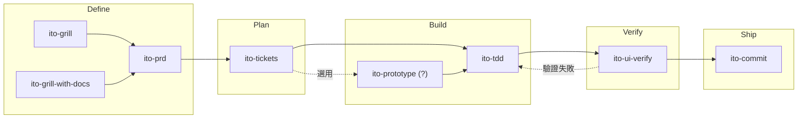
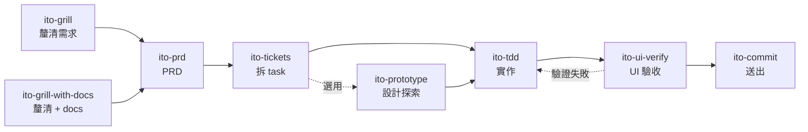

# ITO Agent Skills

## 快速安裝

透過 [`npx skills`](https://github.com/vercel-labs/skills)（Open Agent Skills CLI）可將本 repo 的 skill 安裝到其他專案或使用者全域：

```bash
# 指定 Claude Code 與 Codex，安裝所有 skill
npx skills add steveonead/agent-skills --agent claude-code --agent codex

# 更新已安裝的 skill（用 add 代替 update，繞過 CLI bug #423/#915）
npx skills add steveonead/agent-skills --agent claude-code --agent codex -y

# 互動式刪除：從已安裝的 skill 中選擇要移除的項目
npx skills remove
```

更多參數請見 [vercel-labs/skills](https://github.com/vercel-labs/skills) 文件。

---

## 建議搭配安裝

ito-* 流程會搭配以下工具使用，建議一併安裝：

| 工具 | Repo | 簡介 |
|---|---|---|
| **Context7** | [upstash/context7](https://github.com/upstash/context7) | 為 LLM 取得最新官方文件的 CLI 與 skill，避免以訓練資料猜測 API 或語法。 |
| **DeepWiki MCP** | [CognitionAI/deepwiki](https://github.com/CognitionAI/deepwiki) | 免認證的 remote MCP，可對 GitHub repo 的 AI 生成文件直接提問。 |
| **Exa MCP** | [exa-labs/exa-mcp-server](https://github.com/exa-labs/exa-mcp-server) | Exa 官方 MCP server，提供網路搜尋、網頁爬取與深度研究等能力。 |
| **ast-grep** | [ast-grep/ast-grep](https://github.com/ast-grep/ast-grep) | 以 AST pattern 進行結構化程式碼搜尋與改寫的 CLI 工具。 |
| **Chrome DevTools MCP** | [chrome-devtools-mcp](https://github.com/nickhsmith/chrome-devtools-mcp) | 透過 Chrome DevTools Protocol 在本機瀏覽器執行截圖、DOM 檢查、Console 讀取、Network 攔截與 Performance 分析。 |

---

## 本機輸出與 .gitignore

部分 skill 會在當前專案的 `docs/ito-temp/` 底下產生 markdown 檔案，多屬個人草稿或驗收紀錄，不一定需要進版控。預設輸出路徑統一收斂在 `docs/ito-temp/` 之下，方便以單條規則 ignore：

| 路徑 | 來源 skill | 用途 |
|---|---|---|
| `docs/ito-temp/handoff/` | `ito-handoff` | 交接文件，壓縮當前對話供下一 session 接手 |
| `docs/ito-temp/prd/` | `ito-prd` | 存於 local 的 PRD 文件 |
| `docs/ito-temp/tasks/` | `ito-tickets` | 存於 local 的任務清單 |
| `docs/ito-temp/ui-verify/` | `ito-ui-verify` | UI 驗收報告 |
| `docs/ito-temp/explain/` | `ito-explain` | 架構解釋存檔 |
| `docs/ito-temp/issues/` | `ito-diagnose` | 無 GitHub remote 時的 issue 草稿 |

範例 `.gitignore` 片段：

```
docs/ito-temp/
```

---

## 開發生命週期



**橫向支援 skill**（可在任一階段切出）：

- `ito-explain`：需要建立 codebase mental model 時
- `ito-search`：需要外部資訊（lib API、社群討論、best practice）時
- `ito-diagnose`：遇到 error message、症狀描述或 bug 需系統化診斷時
- `ito-cleanup`：實作完成後整理 code 品質，或手動清理指定檔案時
- `ito-grill-with-docs`：討論 codebase 設計或術語時，疊加 CONTEXT.md 對齊與 ADR 記錄
- `ito-handoff`：session 結束前壓縮對話成交接文件，讓下一 session 無縫接手

**Meta skill**：`ito-skill` 負責建立、修改與審查 skill 本身。

每個 skill 代表一段獨立流程。使用者可從任一階段開始，也可依箭頭方向接續執行。

---

## Slash Commands 總覽

| Slash Command | 階段 | 核心用途 |
|---|---|---|
| `/ito-grill` | Define | 逐一追問決策分支，壓力測試計畫或釐清需求 |
| `/ito-grill-with-docs` | Define | 追問 codebase 設計或架構決策，同步對齊 CONTEXT.md 術語表，收斂後提案 ADR |
| `/ito-prd` | Define | 將需求訪談收斂為結構化 PRD，存至 local 或建立 gh issue |
| `/ito-tickets` | Plan | 深度探索 codebase，將 PRD 拆成含驗收條件與 size 標籤的垂直 slice |
| `/ito-prototype` | Build | 建立一次性 prototype（Logic：terminal TUI / UI：多 variant），回答設計問題後刪除 |
| `/ito-tdd` | Build | 以紅綠重構流程開發新功能，修 bug 時採用 Prove-It Pattern |
| `/ito-ui-verify` | Verify | 透過 Chrome DevTools MCP 依需求執行 UI 層驗證，產出只列失敗項的報告 |
| `/ito-commit` | Ship | 掃描 git 工作區改動並依語意分組，生成 Conventional Commits 計畫 |
| `/ito-cleanup` | Build/Ship | 清理 code 品質問題（debug log、冗餘邏輯、命名等），行為完全保留 |
| `/ito-diagnose` | Debug | 假設驅動的除錯診斷，從 error message 或症狀追查 root cause |
| `/ito-explain` | Support | 派平行 sub-agent 探索 codebase，產出含圖、資料流與設計決策的架構解釋 |
| `/ito-search` | Support | 提供 ctx7／deepwiki／exa／gh 等外部搜尋工具組，由 agent 依 query 自選並過濾劣質網域 |
| `/ito-handoff` | Support | 壓縮當前對話成交接文件，讓下一 session 無縫接手 |
| `/ito-skill` | Meta | 以訪談式流程建立、修改或審查 skill |

---

## Skills 個別說明

### 釐清需求 - [`ito-grill`](.claude/skills/ito-grill/SKILL.md)

**做什麼**
- 沿決策樹分支深挖，一回合只問一題，主動挑戰假設而非被動收集資訊
- 問題分三類：決策型（附推薦理由）、現況確認型、開放型（附預期假設）
- 所有分支都覆蓋、所有假設都被挑戰後才宣告收斂，收斂後在對話中條列摘要並提示 `/ito-handoff`

**使用時機**
- 使用者說「我想討論」、「幫我釐清」
- 需求模糊、需要壓力測試計畫或驗證假設，且方向尚未確立

---

### 釐清 Codebase 決策 - [`ito-grill-with-docs`](.claude/skills/ito-grill-with-docs/SKILL.md)

**做什麼**
- 在 ito-grill 的無情追問基礎上疊加 domain 層：追問時主動對齊 CONTEXT.md 術語、即時更新術語表
- 術語衝突、語意模糊、新術語相似性檢查三道核查，達成共識後立即寫入 CONTEXT.md（不存在時 lazy 建立）
- 收斂後提案符合「難以逆轉、沒有脈絡會令人意外、有真實 trade-off」三門檻的決策為 ADR，並自動掃描舊 ADR 是否需標記取代或棄用

**使用時機**
- 討論 codebase 的設計、架構或領域術語，需要同步維護術語表
- 需要對 codebase 相關計畫進行壓力測試，同時保留決策紀錄（ADR）
- 明確呼叫 `/ito-grill-with-docs`，或提及「對照文件討論」、「更新術語表」

**不適用：** 一般性（非 codebase）討論（→ 改用 ito-grill）；需要直接實作的任務

---

### 產生 PRD - [`ito-prd`](.claude/skills/ito-prd/SKILL.md)

**做什麼**
- 逐題深度訪談，涵蓋現況、痛點、目標、User Stories、AC、Out of Scope、已知侷限
- 支援建立新 PRD 與修改既有 PRD（本地路徑或 issue 編號）兩種模式
- 最終存至 `docs/ito-temp/prd/`，或建立 gh issue（帶 `PRD` label 與 `[PRD-{編號}]` 前綴）

**使用時機**
- 使用者說「寫 PRD」、「整理需求」、「開需求 issue」
- 使用者說「編輯 issue 的 PRD」或提及既有 PRD 路徑

---

### 根據 PRD 拆任務 - [`ito-tickets`](.claude/skills/ito-tickets/SKILL.md)

**做什麼**
- 讀取 PRD（issue 編號、本地路徑或對話），深度探索 codebase 後識別依賴圖
- 切分垂直 slice，每個任務含描述、驗收條件、Blocked by、預計碰的檔案、Size 標籤
- 草稿確認後存至 `docs/ito-temp/tasks/`，或推送為 GitHub sub-issues（含原生 blocked-by 關係）

**使用時機**
- 使用者說「把 PRD 拆成 task」、「建 sub-issue」、「task breakdown」
- `ito-prd` 完成後接著拆 task

---

### 建立 Prototype - [`ito-prototype`](.claude/skills/ito-prototype/SKILL.md)

**做什麼**
- 先判斷問題性質：「邏輯或狀態模型感覺對嗎？」→ Logic 分支（terminal TUI 逐步操作並輸出完整狀態）；「畫面應該長什麼樣？」→ UI 分支（多個截然不同的 variant，可在瀏覽器切換）
- Prototype 命名清楚標示為一次性，一個指令即可啟動，不寫測試、不做抽象化、不做多餘錯誤處理
- 完成後建立 `NOTES.md`（問題 / 答案 / 下一步），再決定刪除或將驗證過的決策摺進正式程式碼

**使用時機**
- 使用者說「做個 prototype」、「先試試看」、「prototype this」、「try a few designs」
- 想驗證狀態機、資料模型或 API 介面是否符合直覺，或在確定設計前先看截然不同的版面

**不適用：** 正式功能實作、需要有測試覆蓋的程式碼、方向已確定只需要直接寫的任務

---

### 執行 TDD - [`ito-tdd`](.claude/skills/ito-tdd/SKILL.md)

**做什麼**
- 規劃介面變更與行為列表後取得批准，再以 tracer bullet 逐條執行 RED → GREEN → REFACTOR
- 測試驗證行為而非實作：透過公開 API 測真實執行路徑，重構後不應失效
- 修 bug 時採用 Prove-It Pattern：先寫能重現 bug 的 failing test，再修改程式碼

**使用時機**
- 使用者明確提到「TDD」、「先寫測試」、「紅綠重構」、「Prove-It」
- 需要測試先行的情境

---

### 驗證 UI - [`ito-ui-verify`](.claude/skills/ito-ui-verify/SKILL.md)

**做什麼**
- 接收 URL 與驗證需求，使用 Chrome DevTools MCP 在真實瀏覽器中執行驗證
- 依需求關鍵字自動啟用對應面向：視覺截圖、Console、DOM 結構、Network、Performance、Accessibility
- 產出只列失敗項的結構化報告，可存至本地或建立 GitHub issue（label: Bug）

**使用時機**
- 使用者說「驗證 UI」、「檢查頁面」、「測試頁面是否符合需求」
- 開發完成後確認頁面行為符合規格，或調查 UI 視覺異常、console error、network 失敗

---

### Git Commit 分組 - [`ito-commit`](.claude/skills/ito-commit/SKILL.md)

**做什麼**
- 讀取 `git diff` 與 `git log`，自動偵測 commit message 語言
- 依語意分組產出 Conventional Commits 計畫，展示後等確認再執行
- `/ito-commit fast` 可將所有非 lock file 變更合為單一 commit
- 不執行 `git push`、不使用 `git add -A`

**使用時機**
- 整理工作區多個性質不同的改動
- 使用者說「commit」、「幫我 commit」、「提交變更」

---

### 清理 Code 品質 - [`ito-cleanup`](.claude/skills/ito-cleanup/SKILL.md)

**做什麼**
- 掃描 git 變更（預設）或指定檔案，清理 debug log、未使用 import、commented-out code、冗餘邏輯、命名問題與結構複雜度
- 行為完全保留：不改變輸入輸出、副作用與 error 行為
- 完成後執行測試套件，通過才展示 diff，失敗則 revert 所有變更

**使用時機**
- 使用者手動呼叫 `/ito-cleanup`（agent 不自行判斷是否執行）
- 實作完成後整理 code 品質，或修正特定 code smell

**不適用：** 修改邏輯、新增功能、大幅重構、未完成的半成品 code

---

### 假設驅動除錯 - [`ito-diagnose`](.claude/skills/ito-diagnose/SKILL.md)

**做什麼**
- 從 error message、stack trace 或症狀描述出發，以「我認為 root cause 是 X，因為具體證據」格式提假設
- 一次只驗證一個假設，連續三次被反證後強制輸出 handoff 報告而非繼續猜測
- 診斷成功後輸出 root cause（含 file:line）、為什麼（因果連結）、影響範圍，推薦直接修復或開 GitHub issue

**使用時機**
- 使用者貼出 error message、exception、stack trace、crash 日誌
- 使用者描述症狀（如「按鈕按下去沒反應」、「logger 沒有出現」）
- 使用者說「這個 error 是什麼意思」、「為什麼會壞」

**不適用：** 無法形成任何假設的極度模糊描述、需要直接修改程式碼、需要 code review

---

### 解釋 Codebase - [`ito-explain`](.claude/skills/ito-explain/SKILL.md)

**做什麼**
- 評估問題複雜度，走 simple（單一 agent）或 complex（2–4 個平行 explorer subagent + synthesizer）路徑
- Complex 路徑平行探索不同角度（如資料模型、渲染流程、scroll 基礎設施），最終彙整
- 產出以使用者提問語言撰寫的結構化說明，完成後詢問是否存至 `docs/ito-temp/explain/`

**使用時機**
- 使用者說「解釋 X 怎麼運作」、「X 架構長怎樣」、「走過 X 的完整流程」
- 需要 onboarding 級別的架構理解或 runtime trace

---

### 外部搜尋 - [`ito-search`](.claude/skills/ito-search/SKILL.md)

**做什麼**
- 提供四類工具：`/find-docs`（官方文件，失敗時 fallback context7）、deepwiki MCP（GitHub repo 架構問答）、exa MCP（社群討論與 best practice）、gh CLI（issue/PR 追蹤）
- 依 query 性質自選或平行執行多工具，結果經黑名單過濾劣質網域
- 輸出附引用來源 URL 清單，一次性查詢，不存檔

**使用時機**
- 使用者明確呼叫 `/ito-search` 或自然語觸發：「幫我查⋯」「搜尋一下⋯」「找一下⋯」
- 需查 lib／framework／SDK 官方 API、GitHub repo 內部運作、bug 訊息、社群討論、best practice

---

### 壓縮對話交接 - [`ito-handoff`](.claude/skills/ito-handoff/SKILL.md)

**做什麼**
- 壓縮當前對話成結構化交接文件，存至 `docs/ito-temp/handoff/[timestamp]-[slug].md`
- 涵蓋本次完成事項、關鍵決策（含決策原因）、未解問題與下一步行動
- 討論型 session 須記錄達成共識的決策與尚未解決的問題
- 支援可選 argument 作為下一 session 的目標焦點

**使用時機**
- 使用者說「handoff」、「交接」、「幫忙整理給下一個 session」
- 任一 session 結束前需要保留脈絡供下一 session 接手
- 明確呼叫 `/ito-handoff`

**不適用：** 需要直接實作功能；純對話摘要（非交接文件）

---

### 建立、修改與審查 Skill - [`ito-skill`](.claude/skills/ito-skill/SKILL.md)

**做什麼**
- **建立模式**：動態訪談收集 name、description、使用時機、核心流程步驟，推斷子目錄需求，預覽確認後寫入
- **編輯模式**：讀取既有 skill 全部檔案，只針對變更點與其直接依賴分支訪談，差異預覽確認後寫入
- **review 模式**：執行 frontmatter 驗證腳本 + rubric 審查，條列問題（含位置與建議），選擇性修正
- 建立與編輯後自動執行自我審查

**使用時機**
- 使用者說「建立一個 skill」、「寫一個 skill」（建立模式）
- 使用者說「改 [skill-name]」、「更新 [skill-name] 的觸發條件」（編輯模式）
- 使用者說「審查 [skill-name]」、「檢查 [skill-name] 的品質」（review 模式）

---

## Skill 之間的關係

### 線性流程



各 skill 的 SKILL.md 已內建主動接手規則：

- `ito-grill` / `ito-grill-with-docs` 收斂後使用者說「那來寫 PRD」，`ito-prd` 主動接手。
- `ito-prd` 完成後使用者說「接著拆 task」，`ito-tickets` 主動接手。
- `ito-prototype` 為 Plan → Build 之間的可選探索步驟，方向確定後再進入 `ito-tdd`。

### 非線性回饋

`ito-ui-verify` 產出只列失敗項的報告（Console error、Network 失敗、DOM 截圖等）。若需要將失敗重現為測試保護，需由使用者手動將報告內容帶入 `ito-tdd` Prove-It Pattern作為起點，兩者之間沒有自動接手機制。

### 隨時可切出的橫向支援

- **`ito-grill`**：在 `ito-prd`、`ito-tickets`、`ito-tdd` 任一階段遇到需求不明或設計分歧時切出，完成後再回原流程。
- **`ito-grill-with-docs`**：在 `ito-tickets`、`ito-tdd` 任一階段討論 codebase 設計或術語時切出，同步維護 CONTEXT.md 術語表與 ADR 決策紀錄，完成後再回原流程。
- **`ito-explain`**：在 `ito-tickets`、`ito-tdd`、`ito-ui-verify` 任一階段需要建立 codebase mental model 時切出，產出架構解釋後再回原流程。
- **`ito-search`**：在任一階段需要外部資訊（lib 官方 API、GitHub repo 內部運作、bug 訊息、社群討論、best practice）時切出，取得附來源 URL 的查詢結果後再回原流程。
- **`ito-diagnose`**：遇到 error message、症狀描述或難以定位的 bug 時切出，確認 root cause 後再決定直接修復或開 issue。
- **`ito-cleanup`**：功能實作完成後、送出前，由使用者手動呼叫清理 code 品質，不由 agent 自行判斷是否執行。
- **`ito-handoff`**：任一 session 結束前，壓縮對話脈絡成交接文件，供下一 session 接手；`ito-grill` / `ito-grill-with-docs` 收斂後亦會提示使用。
- **`ito-skill`**：當上述任一 skill 需要調整或新增時，透過訪談式流程處理，避免直接修改而破壞既有契約。

---

## 設計原則

所有 ito-* skill 皆依循 `ito-skill` 所訂的四大原則：

1. **流程而非散文** — Skill 是 agent 執行的工作流程，每份都具備步驟、檢查點與結束條件，而非供人閱讀的參考文件。
2. **反合理化機制** — 每份 skill 附一張「常見合理化藉口」表，列出 agent 可能用來跳過步驟的藉口，並提供對應反駁。
3. **驗證不可妥協** — 每份 skill 結尾要求具體證據（測試通過、建置輸出、執行時資料），僅憑「看起來沒問題」不足以視為驗證通過。
4. **Progressive disclosure** — `SKILL.md` 為進入點，`references/` 僅在需要時才載入，以降低 token 使用量。

語言與行文規範：

- 所有 skill 內容一律以**繁體中文（台灣用語，`zh-TW`）**撰寫，專有名詞（框架、工具、API、指令、檔案路徑）保留原文。
- 維持技術文件的專業語氣：不用句尾語氣詞、不用網路用語、不用 emoji。
